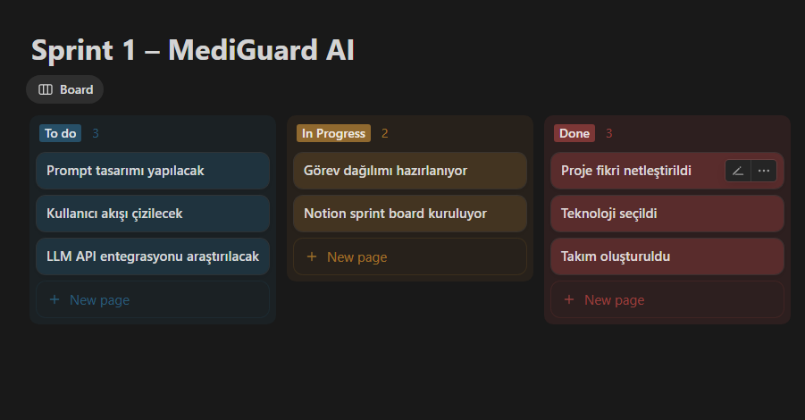

# 💊 MediGuard AI

## 🧠 Proje Tanıtımı

**MediGuard AI**, kullanıcıların girdiği **ilaç isimlerini analiz ederek**, bu ilaçların birlikte kullanıldığında oluşturabileceği **etkileşim riskleri** ve **yan etkileri** hakkında **LLM (Large Language Model)** destekli açıklamalar sunan bir web uygulamasıdır.

---

## 👥 Takım Üyeleri

| İsim             | Rol                      | Sorumluluklar                        |
|------------------|--------------------------|--------------------------------------|
| Tarık Üzgör      | Scrum Master / Developer | Proje yönetimi, LLM entegrasyonu     |
| Ali Rıza Yılmaz  | Developer                | Frontend arayüzü                     |
| Neriman Turhan   | Developer                | API bağlantısı                       |
| Nurican Sarıkaya | Developer                | Prompt mühendisliği                  |
| Şeyma Ersoy      | Developer                | Backend                              |

---

## 🎯 Projenin Amacı

Kullanıcının birden fazla ilaç ismi girmesiyle birlikte, yapay zeka destekli bir sistemin bu ilaçların kullanım alanlarını, yan etkilerini ve birlikte kullanımda ortaya çıkabilecek tehlikeleri doğal dilde yorumlamasını sağlamaktır.

---

## ⚙️ Teknolojiler

| Katman         | Kullanılan Teknoloji                    |
|----------------|-----------------------------------------|
| Backend        | Google Gemini API                       |
| Frontend       | Karar verilmedi                         |
| NLP / Prompt   | Önceden tanımlı tıbbi analiz promptları |
| Dokümantasyon  | Notion                                  |

---

## 📌 Özellikler

- 🧾 **İlaç Etkileşim Analizi**  
  Kullanıcı tarafından girilen ilaçların birbirleriyle etkileşimleri doğal dilde açıklanır.

- 📖 **İlaç Bilgisi Sağlama**  
  İlaçların kullanım alanı, bilinen yan etkileri ve dikkat edilmesi gereken durumlar kullanıcıya sunulur.

- 🧪 **Tahlil Yorumu (Sprint 2+)**  
  Kullanıcı tahlil değerlerini girebilir, sistem bunları yorumlar. (CRP, Ferritin vb.)

- 📄 **(Opsiyonel) PDF ile Otomatik Yorumlama**  
  Laboratuvar sonuçlarının PDF üzerinden okunup analiz edilmesi planlanmaktadır.

---

## 👤 Hedef Kitle

- İlaç kullanan bireyler  
- Kronik hastalığı olanlar  
- Bakıcılar, aile bireyleri  
- Sağlık teknolojilerine meraklı kullanıcılar

---

## 🚧 Sınırlamalar

- Bu uygulama bir **teşhis aracı değildir**  
- LLM çıktıları yalnızca bilgi amaçlıdır, **tıbbi tavsiye yerine geçmez**

---

## 📋 Backlog & Sprint Takibi

Tüm görevler, sprint notları ve proje dokümantasyonu **Notion üzerinden** takip edilmektedir.

👉 [🔗 Notion Proje Sayfası – MediGuard AI](https://www.notion.so/229116d46c038018b913dc3f40e0b152?source=copy_link)

---

## Sprint Board Screenshotları

Sprint 1 görev takibi Notion üzerinden yapılmıştır.

---

## 📁 Sprint Raporları

- 📄 [Sprint 1 Raporu](docs/Sprint1.md)

---

## 🖼️ Ürün Durumu

Aşağıda sprintlere göre güncel ekran görüntüleri, prototipler veya demo bağlantıları paylaşılacaktır.

---

