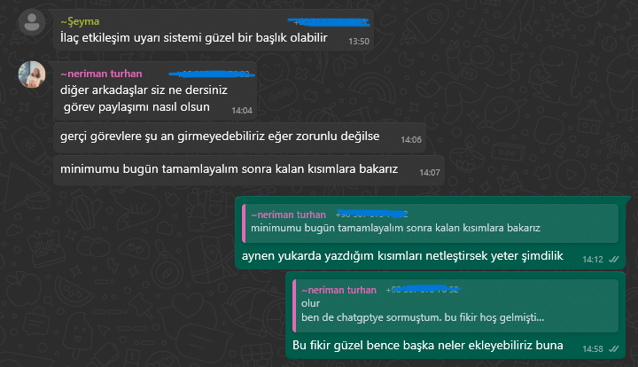

# 🏃‍♂️ Sprint 1 Raporu – MediGuard AI

## Sprint Notları
- Projenin temel fikri belirlendi: LLM tabanlı ilaç etkileşim uyarı sistemi geliştirmek.
- Rule-based yöntemler eklenebilir veya tamamen LLM odaklı çalışılabilir. Projede ilerledikçe karar verilecek.
- Kullanılacak teknolojiler belirlendi: Backend için Google Gemini; frontend için React veya Vue.js. (Frontend değişebilir)
- Proje yönetimi ve iletişim için Notion ve WhatsApp kullanılmasına karar verildi.
- Takım üyeleri ve roller netleştirildi, görev dağılımı yapıldı.

## Sprint İçinde Tamamlanması Tahmin Edilen Puan
- Sprint 1 aşamasında teknik geliştirme başlamadığı için puanlama yapılmamıştır.
- Sprint 2 ve sonrası için API entegrasyonu, frontend geliştirme ve prompt tasarımı gibi işler puanlanacaktır.

## Puan Tamamlama Mantığı
- Proje geliştirme ilerledikçe kullanıcı hikayeleri story point’lerle puanlanacaktır.
- 1–2 SP: Basit UI ve küçük görevler
- 3–5 SP: API istekleri ve orta karmaşıklıkta işler
- 6–8 SP: Kompleks entegrasyon ve testler

## Daily Scrum
- Henüz geliştirme aşamasına geçilmediğinden günlük scrum toplantıları yapılmamıştır.
- İletişim ve koordinasyon WhatsApp üzerinden sağlanmaktadır.
- 

## Ürün Durumu: Ekran Görüntüleri
- Ürün geliştirilmesine başlanmadığı için arayüz veya çıktı ekran görüntüsü bulunmamaktadır.

## Sprint Review
- Sprint 1’de fikir netleştirildi ve yol haritası belirlendi.
- Takım rollerine karar verildi.
- Geliştirme sürecinin nasıl ilerleyeceği konuşuldu.

## Sprint Retrospective

### İyi Gidenler
- Takım üyelerinin hepsi toplandı ve projeye dair iletişim başladı.
- Proje hedefleri netleşti.

### İyileştirilecekler
- Sprint 2 için daha detaylı iş dağılımı planlanmalı.
- Notion kullanımı ve görev takibi ekipçe daha etkin uygulanmalı.

### Aksiyonlar
- Sprint 2’de API entegrasyonu ve frontend geliştirme başlayacak.
- Günlük scrum rutinleri başlatılacak.
