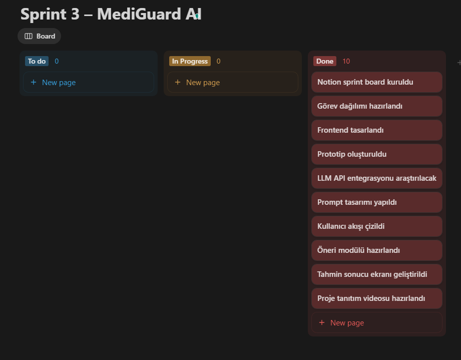
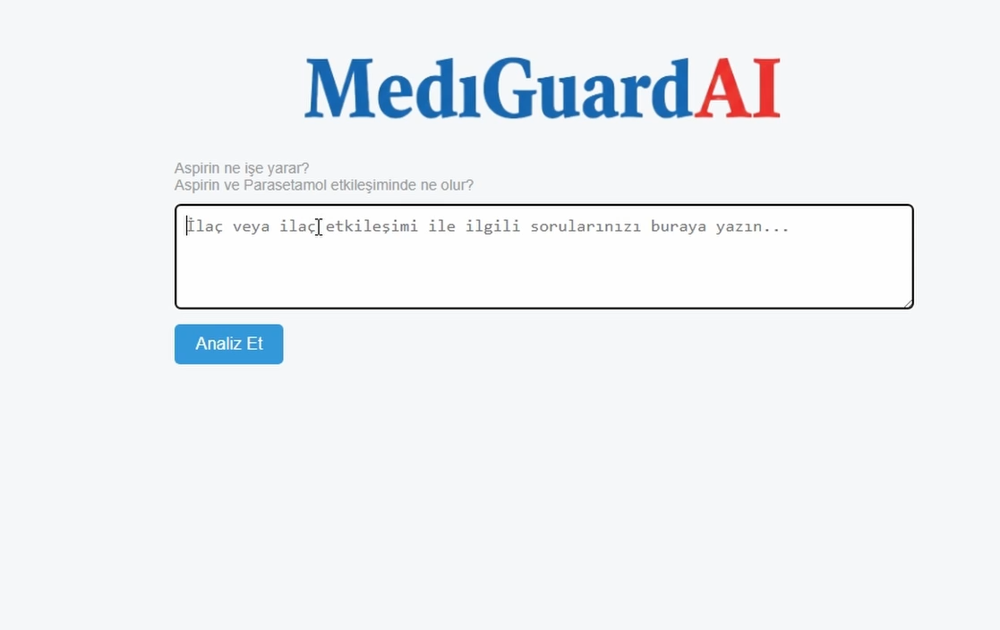
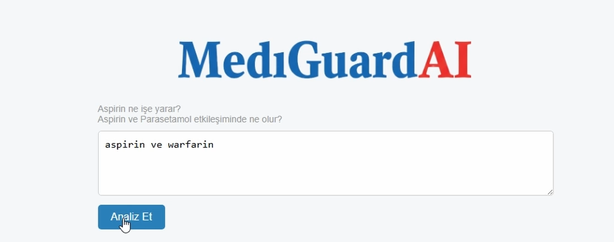
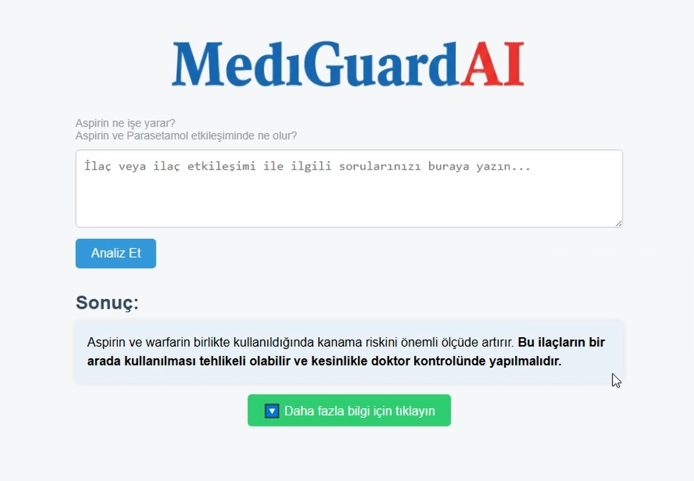
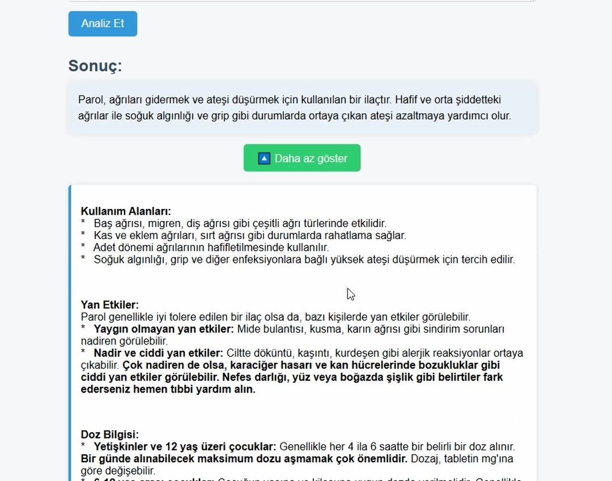

# 🚀 Sprint 3 Raporu – Diabalysis

## 📝 Sprint Notları
Bu sprintte proje tamamlandı. Kullanıcı arayüzü ile backend bağlantısı başarıyla sağlandı. Gemini API bağlantısı kuruldu. Frontend ile backend sorunsuz bir şekilde entegre edildi. Son testlerin ardından sistem başarılı bir şekilde çalıştı ve proje yayına hazır hâle getirildi.

---

## 🎯 Sprint İçinde Tamamlanması Tahmin Edilen Puan

**Toplam:** 21 puan

| Görev                                 | Puan |
|--------------------------------------|------|
| API bağlantısının gerçekleştirilmesi | 8    |
| Son testlerin yapılması              | 5    |
| Model çıktı formatının düzenlenmesi  | 4    |
| UI iyileştirmeleri                   | 4    |

---

## 📌 Puan Tamamlama Mantığı
Puanlar, görevin tahmini zorluk derecesi ve iş gücüne göre ekip içinde kararlaştırıldı. Zorluk, zaman alıcılık ve teknik bilgi ihtiyacına göre puanlama yapıldı (1–8 arası).

---

## ☕ Daily Scrum
Ekip olarak günlük iletişim WhatsApp üzerinden sürdürüldü. Ayrıca 1 adet Google Meet toplantısı gerçekleştirildi.

---

## 🗂️ Sprint Board (Notion)
Sprint board, Notion üzerinden takip edilmiştir.

---

## 💻 Ürün Durumu: Ekran Görüntüleri
  
  
  
  

---

## ✅ Sprint Review
- Proje tamamlandı.
- Model çıktıları başarıyla alındı.
- UI son düzenlemeleri yapıldı.
- Testler geçti ve sistem çalıştı.

---

## 🔁 Sprint Retrospective

**İyi Gidenler:**
- Backend entegrasyonu sorunsuzdu.
- İletişim güçlüydü.
- Ekip uyumu yüksekti.

**İyileştirme Gerekenler:**
- Test süreci daha önce başlatılabilirdi.
- Ekran tasarımı erkenden kararlaştırılmalıydı.

**Alınan Aksiyonlar:**
- Gelecek projelerde test süreci için ayrı zaman planlanacak.
- UI kararları sprint başında kesinleştirilecek.
